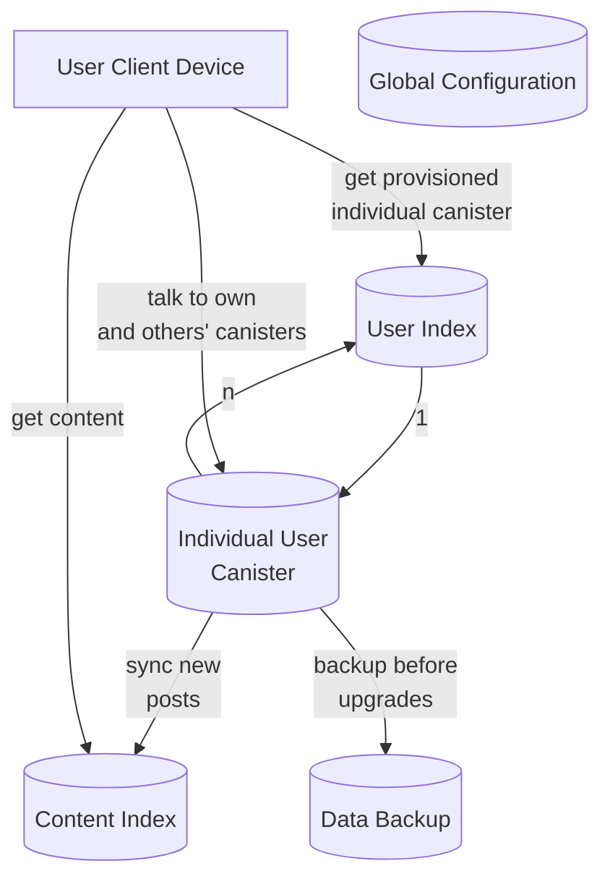

# Architecture

```mermaid
  flowchart
    UserClient[User Client Device]
    UserIndex[(User Index)]
    IndividualUserCanister[(Individual User <br>Canister)]
    ContentIndex[(Content Index)]
    GlobalConfiguration[(Global Configuration)]
    DataBackup[(Data Backup)]


    UserIndex -- 1 --> IndividualUserCanister
    IndividualUserCanister -- n --> UserIndex
    IndividualUserCanister -- sync new <br> posts --> ContentIndex
    IndividualUserCanister -- backup before <br> upgrades --> DataBackup
    UserClient -- get provisioned <br> individual canister --> UserIndex
    UserClient -- get content --> ContentIndex
    UserClient -- talk to own <br> and others' canisters --> IndividualUserCanister
```
