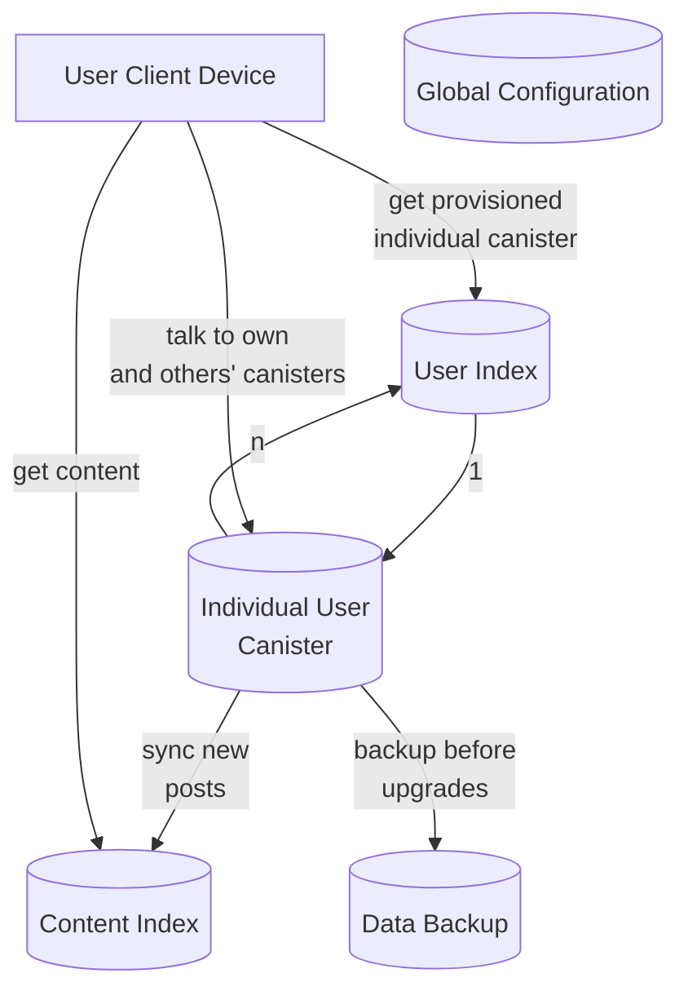

# Architecture

# Commonly used dfx commands

## Try upgrading a canister to the latest wasm manually

- `dfx canister call user_index upgrade_specific_individual_user_canister_with_latest_wasm '(principal "", principal "", null)' --network ic`

## Deposit cycles to a canister

- `dfx canister deposit-cycles 1000000000000 <canister_id> --network ic // 1T cycles`

## Run the upgrade only on the canisters that failed their upgrade

- `dfx canister call user_index retry_upgrade_for_canisters_that_failed_upgrade_with_the_latest_wasm --network ic`

# ICP -> WICP -> XTC -> Cycles

## Check principal's XTC balance

`dfx canister --network=ic call --query aanaa-xaaaa-aaaah-aaeiq-cai balanceOf "(principal \"$(dfx identity get-principal)\")"`

## Burn XTC to add cycles to principal's wallet

`dfx canister --network=ic call aanaa-xaaaa-aaaah-aaeiq-cai burn "(record { canister_id= principal \"$(dfx identity get-wallet --network ic)\"; amount= (1000000000000:nat64)})"`

Burn XTC to cycles operation burns 2B cycles

## Steps

- bump dependencies
- Add a canister_status method for user_index (current canister count and cycle balance)
- Add auto canister topups if upgrade fails and balance below .5T cycles
- Add multiple upgrades at a time
- Add canister upgrades to user_index post_upgrade
- Remove any controller except itself
