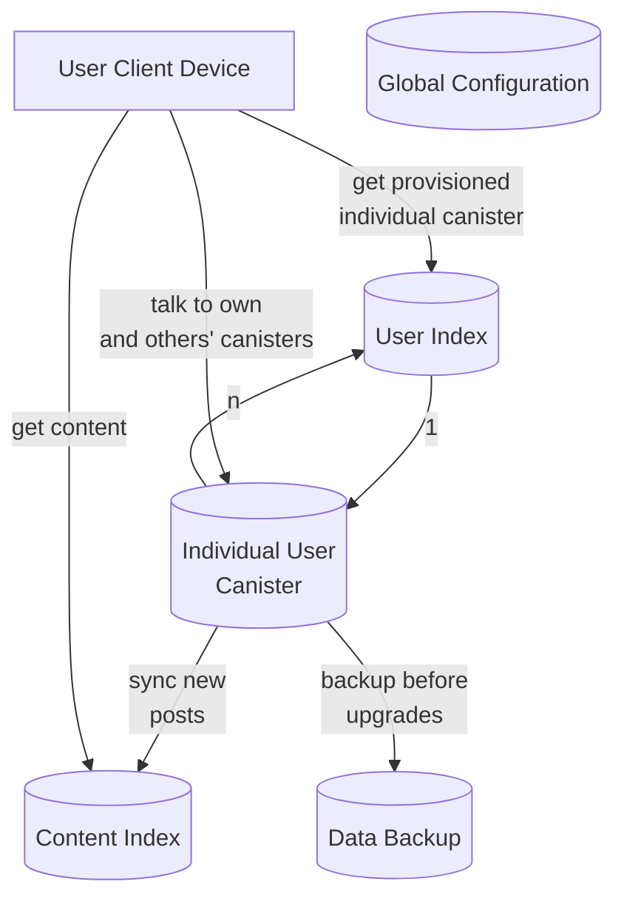

# Hot or Not

---

# Architecture

---

# Difficulties

---

# Authorization mechanism for canisters belonging to the same project

- [Forum post going over difficulties](https://forum.dfinity.org/t/feature-request-mechanism-to-figure-out-if-a-call-to-a-canister-comes-from-canisters-belonging-to-the-same-project/15597)
- Actors part of the same project should be able to share information with each other behind a trusted boundary
- Especially important for canisters that are part of the same project but are deployed on different subnets

---

# Multi subnet support

- **Preferred** Either go completely serverless and handle splitting and balancing automatically and transparently. Handle additional complexity at the protocol level
- Or give developers explicit control over subnet selection and balancing
- Dont do the current approach of playing the wallet provisioning roulette to get desired subnet

---

# Enable Cross Subnet Queries for Inter Canister Query Calls and simplify the constraints

- [Forum post going over overly complicated low level details and gotchas that developers would need to reason about](https://forum.dfinity.org/t/proposal-composite-queries/15979/48)
- No mechanism to test ICQC calls reliably on a local environment

---

# REQUEST: Is it possible to remove canister creation costs for apps beyond a certain threshold?

- For a million canisters created, we would have to spend around $130,000 just as burn costs for canister creation.
- We would like to request that the canister creation costs be removed for apps that have more than a certain number of canisters.

---

# Protocol Native backup and restore mechanism - snapshot/incremental

- [Forum Post 1](https://forum.dfinity.org/t/canister-backup/11777)
- [Forum Post 2](https://forum.dfinity.org/t/backup-restore-function-for-a-canister/12849)

---

# Handle chunking at the protocol level instead of the application level

- Lower level detail, should be handled by the protocol like how TCP/IP handles
  packets transparently without devs needing to think about it
- Boilerplate implementations would lead to hard to reproduce bugs that only applications with large loads would face
- [Example Video showing how even Dfinity DevRel was confused while demoing
  code that they wrote. Fairly confusing for prospective dapp devs](https://www.youtube.com/watch?v=0O4M0W47KKA)

---

# Better primitives for working with stable memory

- Started off with a [community written library](https://github.com/seniorjoinu/ic-stable-memory)
  - Unreliable, had memory leaks. [Subnet memory snapshot](https://dashboard.internetcomputer.org/subnet/o3ow2-2ipam-6fcjo-3j5vt-fzbge-2g7my-5fz2m-p4o2t-dwlc4-gt2q7-5ae)
  - Backward incompatible changes
  - Led to costly rewrite that required removal
- Now relying on a [library that is maintained by Dfinity](https://github.com/dfinity/stable-structures)
  - Limit usage to our backup canister
  - No support for dynamically sized objects memory. Requires upfront allocation
    of memory
  - Backward incompatible schema changes

---

# Safer primitives for canister upgrades using pre/post upgrade hooks

- Fragile and irrecoverable. Footgun for even experienced devs. Lots of failures:
  - [Example](https://forum.dfinity.org/t/dfx-0-12-0-install-fail-after-upgrade/16461)
  - [Example](https://forum.dfinity.org/t/fail-a-canister-upgrade/5809)
- Even Dfinity team members disagree on [THE RIGHT WAY](https://forum.dfinity.org/t/feature-request-if-pre-upgrade-fails-revert-canister-to-earlier-state-snapshot-of-before-pre-upgrade-ran-and-discard-current-pre-upgrade-logic/17605)

---

# Future Needs

- Storage subnets
- GPUs for hardware accelerated
  - video encoding/decoding
  - training neural networks
