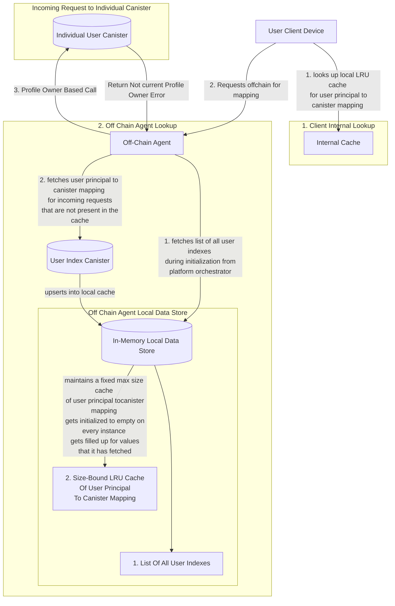

```mermaid
  flowchart
  IndividualUserCanister[(Individual User Canister)]
  InMemoryLocalDataStore[(In-Memory Local Data Store)]
  ListOfAllUserIndexes[1. List Of All User Indexes]
  OffChainAgent[Off-Chain Agent]
  SizeBoundLRUCacheOfUserPrincipalToCanisterMapping[2. Size-Bound LRU Cache <br/> Of User Principal <br/> To Canister Mapping]
  UserClientDevice[User Client Device]
  UserClientDeviceInternalCache[Internal Cache]
  UserIndexCanister[(User Index Canister)]

  UserClientDevice -- 1. looks up local LRU cache <br/> for user principal to canister mapping <br/> --> UserClientDeviceInternalCache

  subgraph "1. Client Internal Lookup"
    UserClientDeviceInternalCache
  end


  UserClientDevice -- 2. Requests offchain for mapping --> OffChainAgent
  subgraph "2. Off Chain Agent Lookup"
    OffChainAgent -- 1. fetches list of all user indexes <br/> during initialization from platform orchestrator --> InMemoryLocalDataStore
    OffChainAgent -- 2. fetches user principal to canister mapping <br/> for incoming requests <br/> that are not present in the cache --> UserIndexCanister
    UserIndexCanister --  upserts into local cache --> InMemoryLocalDataStore

    subgraph "Off Chain Agent Local Data Store"
      InMemoryLocalDataStore -- maintains a fixed max size cache <br/> of user principal tocanister mapping <br/> gets initialized to empty on every instance <br> gets filled up for values that it has fetched --> SizeBoundLRUCacheOfUserPrincipalToCanisterMapping
      InMemoryLocalDataStore ----> ListOfAllUserIndexes
    end
  end

  OffChainAgent -- 3. Profile Owner Based Call --> IndividualUserCanister

  subgraph "Incoming Request to Individual Canister"
    IndividualUserCanister -- Return Not current Profile Owner Error --> OffChainAgent
  end
```

## Mapping storage in User index

- Store the mapping of canisters in user_indexes that are not actually controllers
- Store assigned user_index in auth service claims
