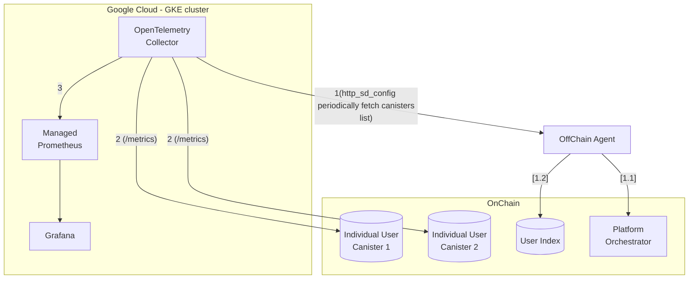

```mermaid
flowchart TD
    IndividualCansiter1[(Individual User <br>Canister 1)]
    IndividualCansiter2[(Individual User <br>Canister 2)]
    UserIndex[(User Index)]
    PlatformOrchestrator[Platform <br>Orchestrator]
    OffChainAgent[OffChain Agent]
    OTC[OpenTelemetry <br>Collector]
    GMP[Managed <br>Prometheus]
    Grafana[Grafana]

    OffChainAgent --[1.1]--> PlatformOrchestrator
    OffChainAgent --[1.2]--> UserIndex

    OTC -- 1(http_sd_config <br> periodically fetch canisters list) --> OffChainAgent
    OTC -- 2 (/metrics) --> IndividualCansiter1
    OTC -- 2 (/metrics) --> IndividualCansiter2

    subgraph OnChain
        PlatformOrchestrator
        UserIndex
        IndividualCansiter1
        IndividualCansiter2
    end

    subgraph GoogleCloud[Google Cloud - GKE cluster]
        OTC -- 3 --> GMP
        GMP --> Grafana
    end
```
