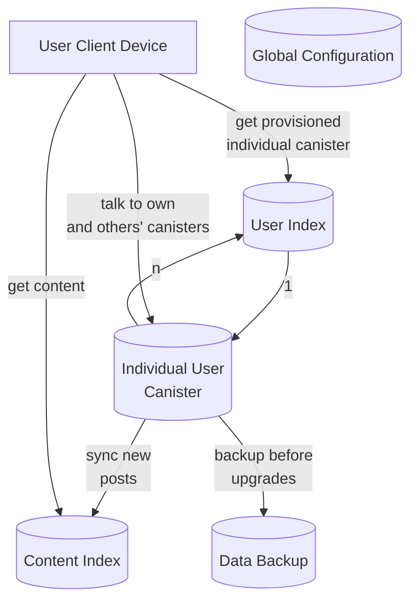
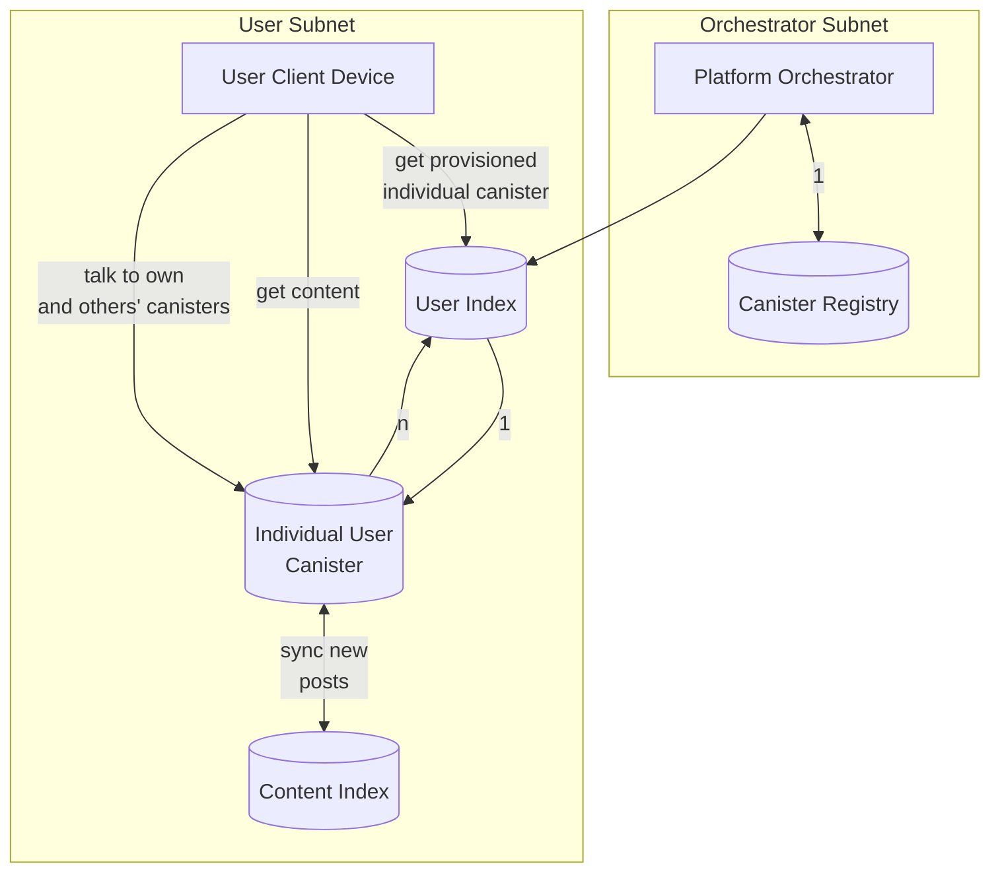

# Current Architecture

## Upcoming Architecture

# Proposed Changes

- Have a configuration canister that pushes changes downstream on every subnet
- Test serializing entire canister contents and then sending it elsewhere to be reinitialized on a different subnet or archived off chain
- Embrace stable memory to eliminate the cost of upgrades
- Embrace subnet ownership to eliminate the cost of new canister creation
- Canister recycling
  - Track user sessions
  - Reclaim if beyond threshold
  - Figure out what to do with the data.

## Scaling

- Subnet splitting
- Manual sharding
  - On chain
  - Off chain
