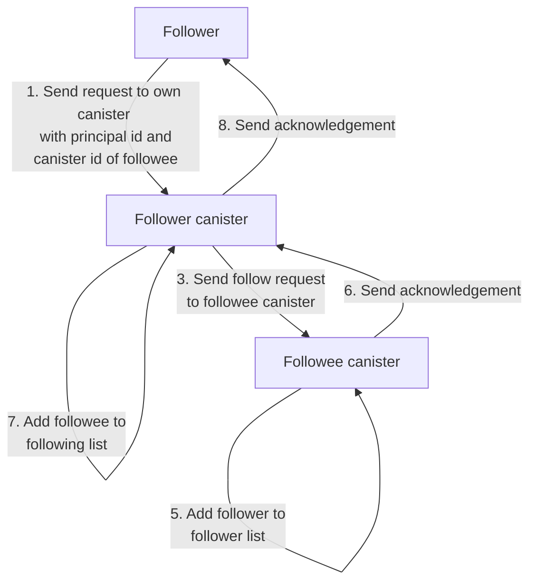

# API

- Follower can follow a followee
- Get a list of followers
- Get a list of following

# Flow

```mermaid
flowchart
    Follower[Follower]
    FollowerCanister[Follower canister]
    FolloweeCanister[Followee canister]

    Follower -- 1. Send request to own canister <br> with principal id and <br>canister id of followee --> FollowerCanister
    FollowerCanister -- 2. Verify request originated <br> from follower and following <br> list not full--> FollowerCanister
    FollowerCanister -- 3. Send follow request <br> to followee canister --> FolloweeCanister
    FolloweeCanister -- 4. Verify that follower list not <br>full and canister id to save <br>matches sender--> FolloweeCanister
    FolloweeCanister -- 5. Add follower to <br> follower list --> FolloweeCanister
    FolloweeCanister -- 6. Send acknowledgement --> FollowerCanister
    FollowerCanister -- 7. Add followee to <br> following list --> FollowerCanister
    FollowerCanister -- 8. Send acknowledgement --> Follower
```
