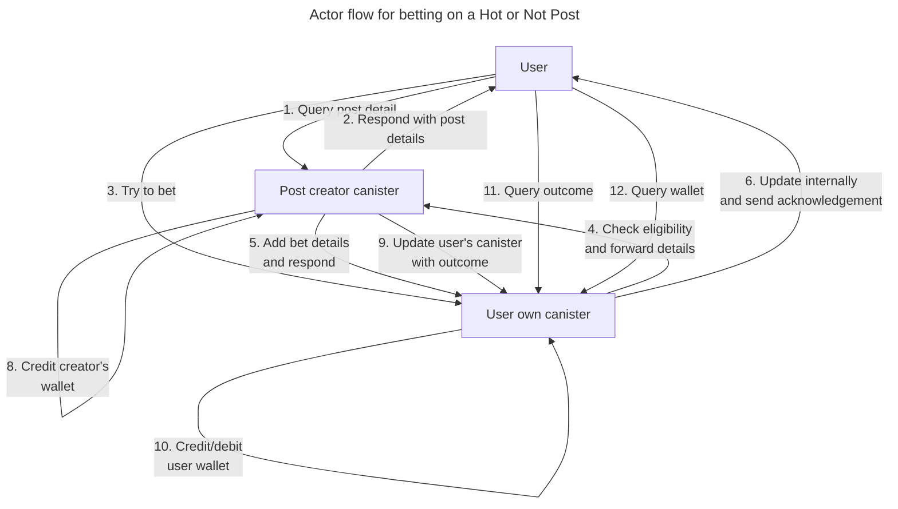
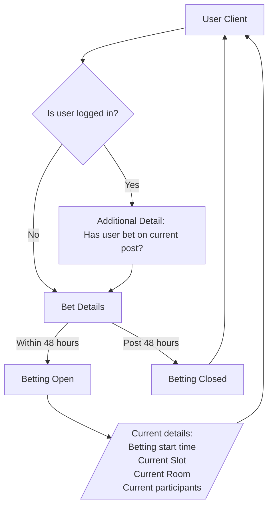
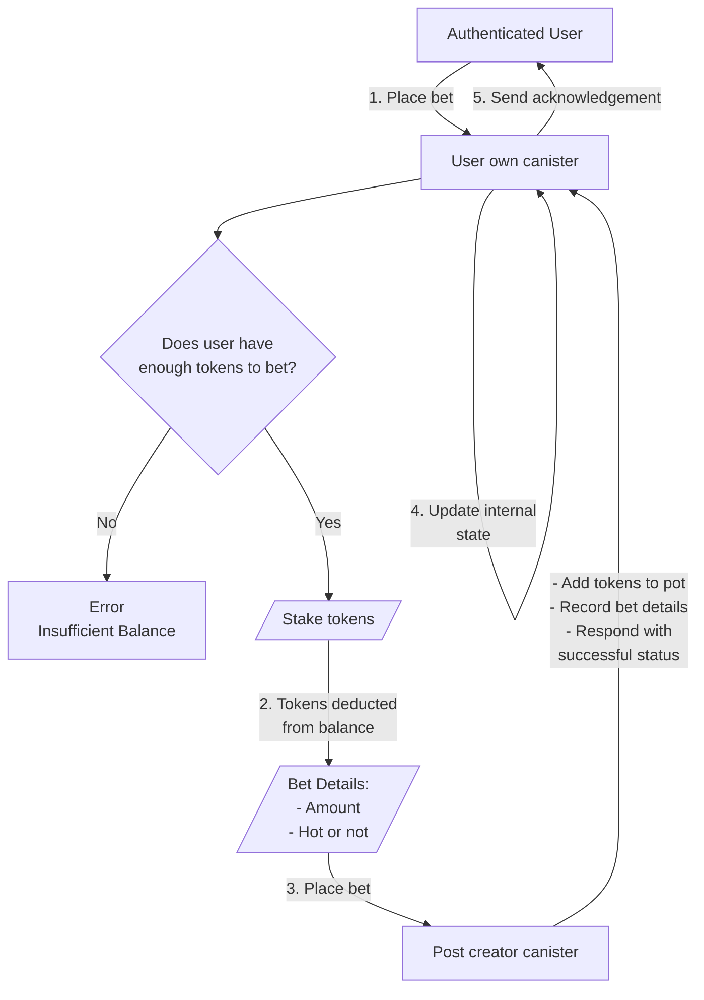
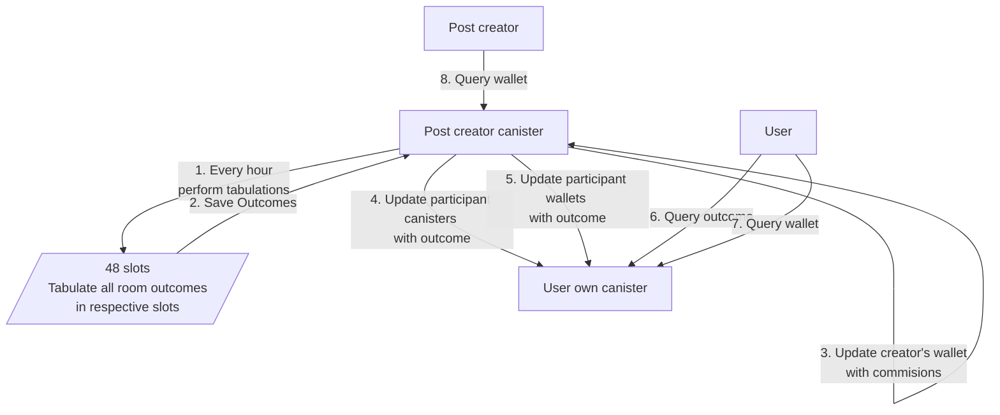

# Scenarios

- Anonymous/authenticated user queries a post for hot or not details
- Authenticated user places a bet on a post
- Betting slot ends and outcomes are calculated
  - Outcomes are stored in the creator's and bet maker's canister
  - Creator and bet maker wallets are updated accordingly

# Visualization

## Query post details

## Place a bet

## Tabulate outcomes and update wallets

