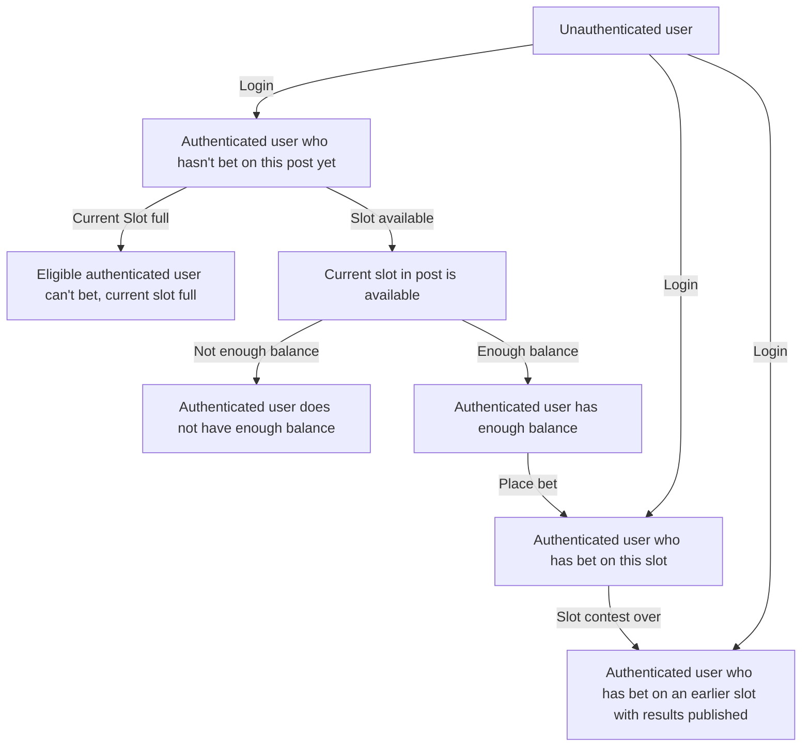

# Possible User States

- Unauthenticated
- Authenticated
  - Not bet
    - Enough balance
    - Not enough balance
  - Bet on this slot
    - awaiting results
  - Bet on earlier slot
    - won
    - lost
    - draw

# Possible Post States

- Betting open
  - Slot available out of 100
  - Current Slot full
- All betting periods transpired

# Visualization

